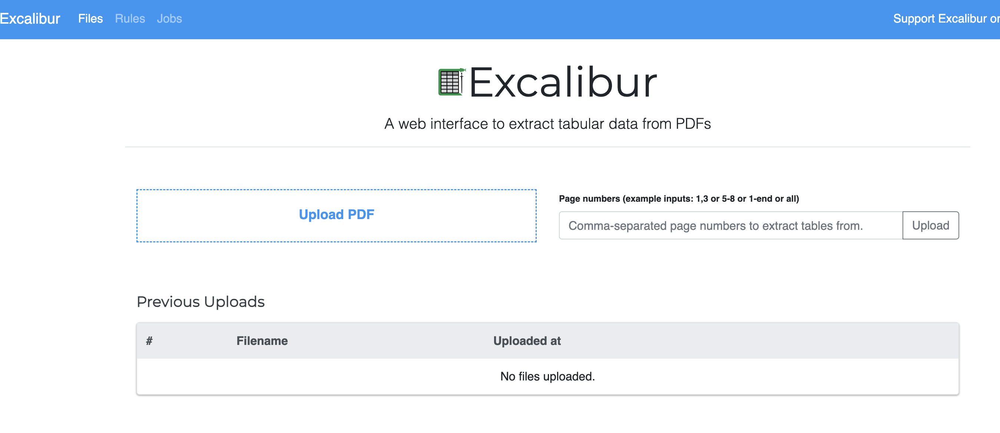
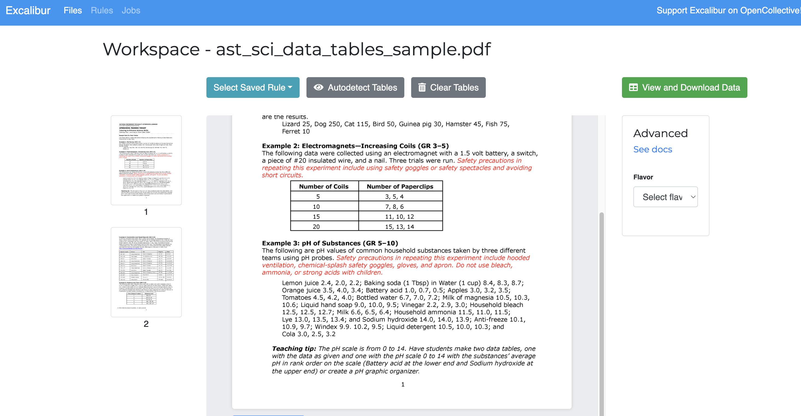
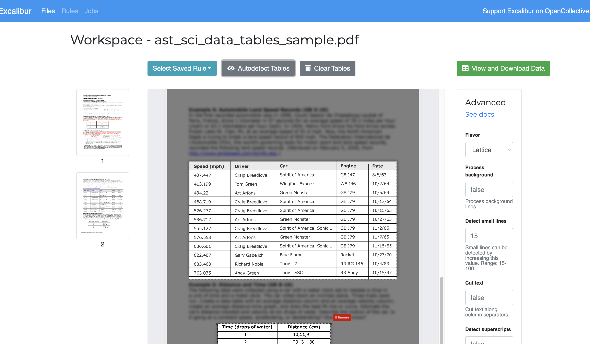
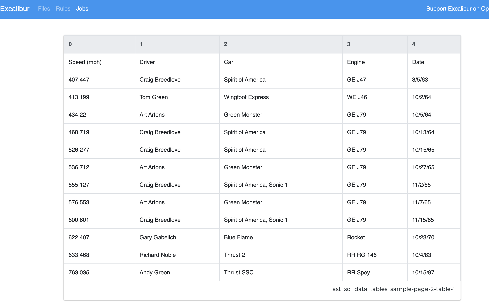

> 注：当前项目为 Excalibur 应用

# Excalibur

本案例是将 Excalibur 快速创建并部署到函数计算（FC）。Excalibur 组合了 Camelot 和 Excalibur 的功能，用于从 PDF 文件中提取表格数据，并提供易用的 Web 界面，用户可以利用该服务高效提取 PDF（注：仅适用于基于文本的 PDF，不适用于扫描文档） 文件中的表格数据。
所有文件和 PDF 要么完全存在于客户端，要么仅在任务执行期间驻留在服务器内存中，或者仅为执行任务而临时存在于文件中。用户下载的任何文件在那时都将从服务器中删除。

- [Excalibur 应用代码](https://github.com/Qihoo360/fc-templates/tree/main/applications/data-processor/excalibur/src)

## 前期准备

使用该项目，您需要有开通以下服务并拥有对应权限：

| 服务/业务 |
| --------- |
| 函数计算  |

## 部署 & 体验

- 通过 智汇云官网 -> 产品列表 -> Serverless开发 -> 函数计算 FC，部署该应用。

## 案例介绍

## 使用流程

### 📖 文档

- [Camelot 文档](https://camelot-py.readthedocs.io/en/master)
- [Excalibur 文档](https://excalibur-py.readthedocs.io/en/master)

### :wave: 特点

- 从 PDF 提取表格是困难的。简单地从 PDF 复制粘贴到 Excel 中无法保留表格结构。**Excalibur 使 PDF 表格提取变得非常简单**，它可以自动检测 PDF 中的表格，并让您将其保存为 CSV 和 Excel 文件
- Excalibur 在底层使用 [Camelot](https://camelot-py.readthedocs.io/)，这为您提供了额外的设置选项，可以调整表格提取以获得最佳结果。您可以在这个[比较](https://github.com/socialcopsdev/camelot/wiki/Comparison-with-other-PDF-Table-Extraction-libraries-and-tools)中看到它如何优于其他开源工具和库
- 您可以为 PDF 保存表格提取[设置](https://excalibur-py.readthedocs.io/en/master/user/faq.html#faq)（如表格区域），并在新的 PDF 上应用这些设置，以提取具有相似结构的表格
- 您可以完全控制您的数据。所有文件存储和处理都发生在您自己的本地或远程机器上
- Excalibur 默认情况下，使用 sqlite 和多进程处理顺序工作负载
