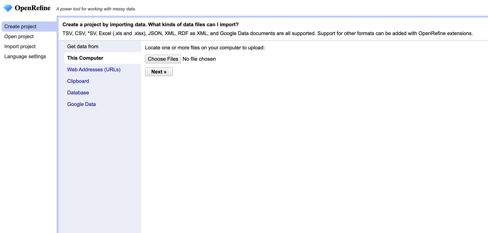
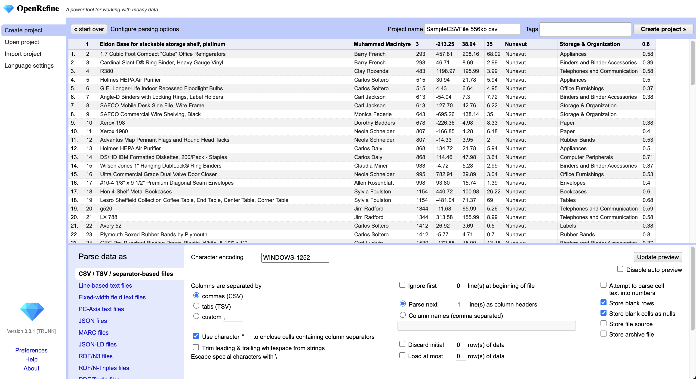

> 注：当前项目为 openRefine 应用

# OpenRefine

本案例是将 OpenRefine 快速创建并部署到函数计算（FC）。OpenRefine 是一个基于 Java 的强大工具，允许您加载数据、理解数据、清理数据、对数据进行协调，并使用来自网络的数据进行增强。所有这些操作都可以通过网页浏览器在您自己的计算机上私密地进行。通过该应用，用户能够高效创建和管理数据处理服务，大大提升数据处理的便利性和管理效率。

- [OpenRefine 应用代码](https://github.com/Qihoo360/fc-templates/tree/main/applications/data-processor/openrefine/src)

## 前期准备

使用该项目，您需要有开通以下服务并拥有对应权限：

| 服务/业务 |
| --------- |
| 函数计算  |

## 部署 & 体验

- 通过 [Serverless 应用中心](https://console.zyun.qihoo.net/fc), 部署该应用。

## 案例介绍

## 使用流程

### 📖 文档

- [官方网站](https://openrefine.org)
- [用户手册](https://openrefine.org/docs)
- [FAQ](https://github.com/OpenRefine/OpenRefine/wiki/FAQ)

## 开发者社区

- [社区论坛](https://forum.openrefine.org/)
