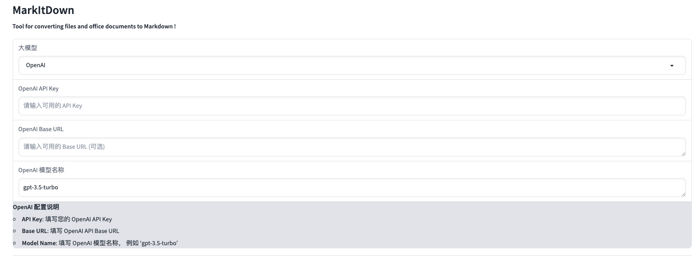
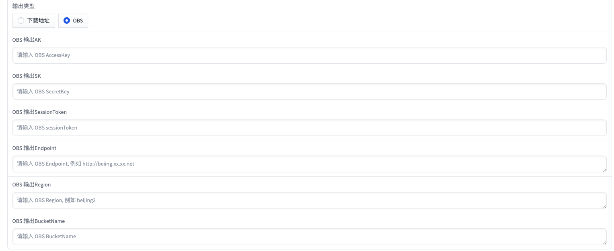

> 注：当前项目为 markitdown 应用

# markitdown 帮助文档

本案例是将 markitdown - 用于将文件和办公文档转换为 markdown 的工具，快速创建并部署到函数计算 FC 。

- [:smiley_cat: 代码](https://github.com/Qihoo360/fc-templates/tree/feature/fc-app-test/applications/file-processor/markitdown/src)

## 前期准备

使用该项目，您需要有开通以下服务并拥有对应权限：

| 服务/业务 |
| --- |
| 函数计算 |

## 部署 & 体验

- :fire: 通过 智汇云官网 -> 产品列表 -> Serverless开发 ->函数计算 FC，部署该应用。

## 案例介绍

**MarkItDown**

MarkItDown 是一个用于将各种文件转换为 Markdown 的工具（例如用于索引、文本分析等）。它支持以下文件类型：
- PDF
- PowerPoint
- Word
- Excel
- 图片（提取 EXIF 元数据和 OCR 识别）
- 音频（提取 EXIF 元数据和语音转录）
- HTML
- 文本格式（CSV、JSON、XML）
- ZIP 文件（迭代处理其中的内容）

## 使用流程

### ❗注意事项
- 针对需要 OCR 的图片，需要填写大模型相关的API，国内推荐 OneAPI 服务，还有需要指定的模型支持 OCR

- 文件来源:支持 `本地文件`、`Web地址`、`OBS`; `OBS` 支持 `sts` 方式的临时授权

- 输出类型:支持 `下载地址`、`OBS`; `OBS` 支持 `sts` 方式的临时授权

### 📖 文档
- [MarkItDown 官网](https://github.com/microsoft/markitdown)

### 👋 特点

MarkItDown 是一个由 Microsoft 开源的工具，专注于将各种文件格式转换为 Markdown。它的目标是为文件的索引、文本分析以及内容提取提供便捷途径。

MarkItDown 支持多种常见的文件格式，便于统一处理不同来源的数据：
- 文档类型: PDF、Word、PowerPoint、Excel。
- 图片: 支持提取 EXIF 元数据及 OCR（光学字符识别）。
- 音频: 支持提取 EXIF 元数据和语音转录。
- 文本文件: 支持 CSV、JSON 和 XML 格式。
- HTML: 解析和转换为 Markdown。
- 压缩文件: 支持 ZIP 文件的内容迭代处理。

#### Markdown 转换

提供强大的转换能力，将各种文件内容提取后转换为 Markdown 格式，便于后续的文本操作和分析。

#### 元数据提取

不仅能提取文件的主要内容，还支持提取丰富的元数据，例如：
- 图片的 EXIF 信息。
- 音频文件中的元数据（标题、作者等）。

#### OCR 和语音转录

- OCR: 使用光学字符识别技术从图片中提取文本。
- 语音转录: 从音频文件中提取语音内容并转录为文本。

#### 递归处理 ZIP 文件

对于 ZIP 压缩文件，支持递归遍历内容并逐一处理文件。
