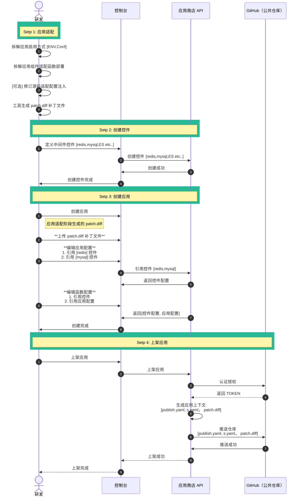
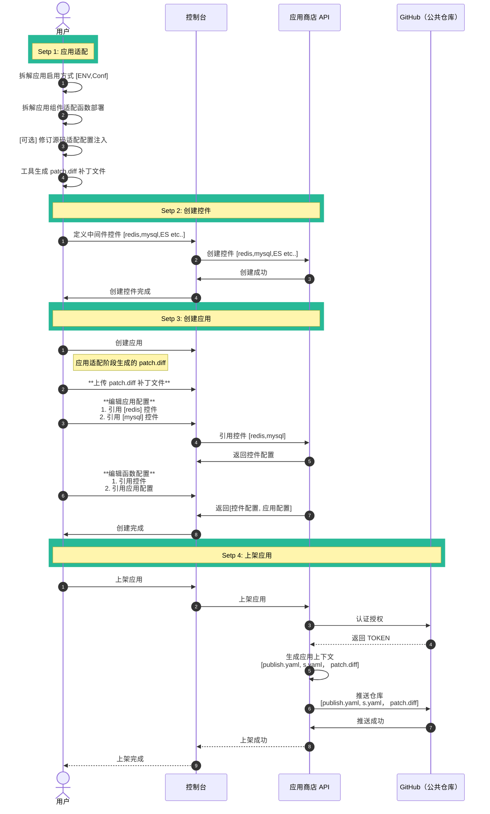
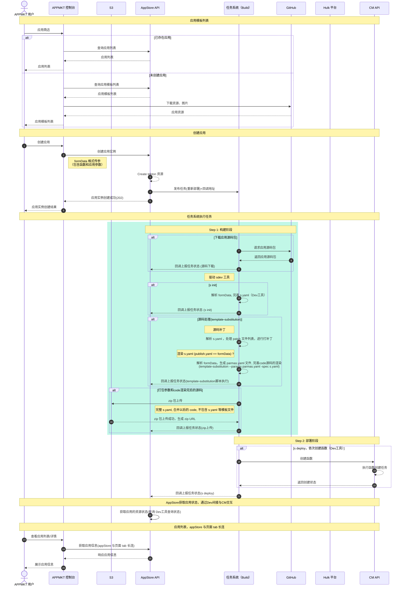

## 应用市场主要流程与阶段

- 适配应用
  - 设计应用配置
  - 组件适配为函数
  - 生成 patch 补丁文件
- 上架应用
  - 创建中间件配置
  - 创建应用配置
  - 创建函数配置
    - 函数常规配置
    - 引用中间件、应用配置
    - 上传 patch 文件
  - 发布应用
- 部署应用
  - 下载应用源码包
  - 预处理应用源码
  - 构建编译应用组件
  - 部署应用的函数

## 应用上架流程

## 应用使用流程

## 应用部署流程

## 原始工作流程

> CHANGELOG:
> - 添加颜色区分任务系统的构建阶段
> - 添加关键流程描述
> - 添加 patch 处理流程

