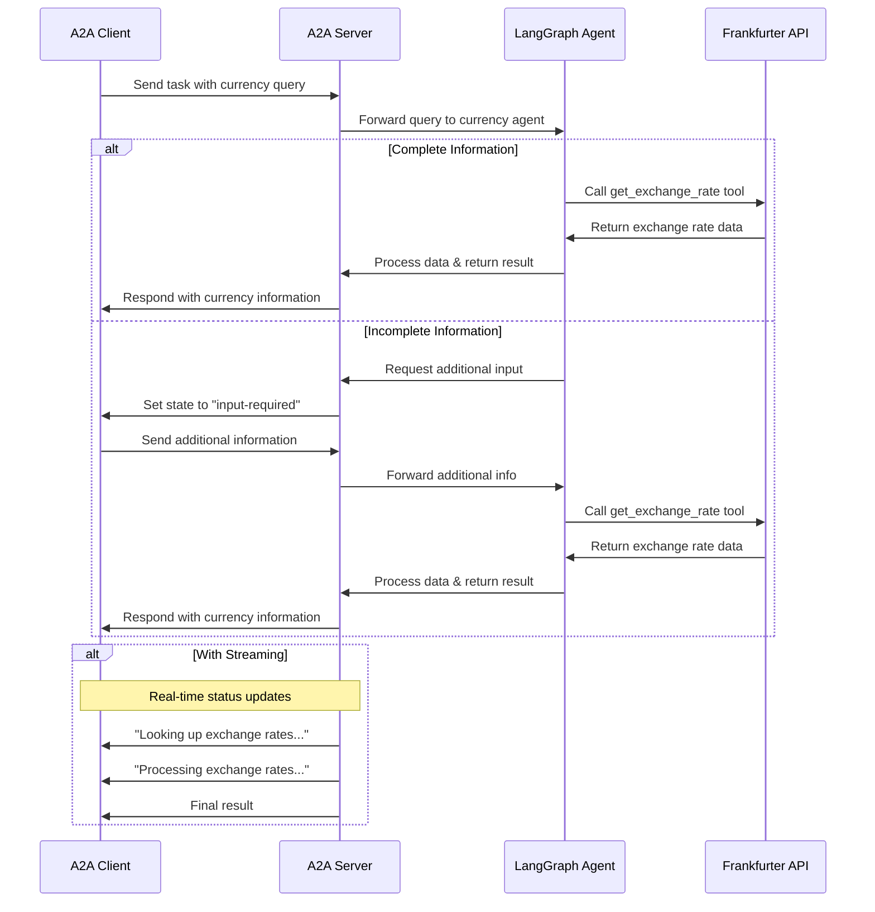

# LangGraph Currency Agent with A2A Protocol

此示例展示了一个使用 LangGraph 构建并通过 A2A 协议公开的货币转换代理。它展示了支持多轮对话和流式响应的对话式交互。

- [Agent 示例代码](https://github.com/Qihoo360/fc-templates/tree/feature/main/examples/agent-runtime/http-function/fc-python/python3.12/agent-airun/langgraph/src/code/handler)

## 如何工作



## 前期准备

使用该项目，您需要有开通以下服务并拥有对应权限：

| 服务/业务 |
| --------- |
| 函数计算  |

## 部署 & 体验

- 通过 智汇云官网 -> 产品列表 -> Serverless开发 -> 函数计算 FC，部署该应用。
- 配置环境变量： 
TOOL_LLM_URL = "https://api.example.com/llm" ，
TOOL_LLM_NAME = "gpt-4" ，
API_KEY = "your_api_key_here"

## 应用使用示例

在控制台完成业务功能部署，完成会出现触发器url。
此时，使用 postman 或者 curl 工具， 就可以对触发器url进行请求。

**Synchronous request**

Request:

```
POST http://localhost:10000
Content-Type: application/json

{
    "id": "12113c25-b752-473f-977e-c9ad33cf4f56",
    "jsonrpc": "2.0",
    "method": "message/send",
    "params": {
        "message": {
            "kind": "message",
            "messageId": "120ec73f93024993becf954d03a672bc",
            "parts": [
                {
                    "kind": "text",
                    "text": "how much is 10 USD in INR?"
                }
            ],
            "role": "user"
        }
    }
}
```

Response:

```
{
    "id": "12113c25-b752-473f-977e-c9ad33cf4f56",
    "jsonrpc": "2.0",
    "result": {
        "artifacts": [
            {
                "artifactId": "08373241-a745-4abe-a78b-9ca60882bcc6",
                "name": "conversion_result",
                "parts": [
                    {
                        "kind": "text",
                        "text": "10 USD is 856.2 INR."
                    }
                ]
            }
        ],
        "contextId": "e329f200-eaf4-4ae9-a8ef-a33cf9485367",
        "history": [
            {
                "contextId": "e329f200-eaf4-4ae9-a8ef-a33cf9485367",
                "kind": "message",
                "messageId": "120ec73f93024993becf954d03a672bc",
                "parts": [
                    {
                        "kind": "text",
                        "text": "how much is 10 USD in INR?"
                    }
                ],
                "role": "user",
                "taskId": "58124b63-dd3b-46b8-bf1d-1cc1aefd1c8f"
            },
            {
                "contextId": "e329f200-eaf4-4ae9-a8ef-a33cf9485367",
                "kind": "message",
                "messageId": "d8b4d7de-709f-40f7-ae0c-fd6ee398a2bf",
                "parts": [
                    {
                        "kind": "text",
                        "text": "Looking up the exchange rates..."
                    }
                ],
                "role": "agent",
                "taskId": "58124b63-dd3b-46b8-bf1d-1cc1aefd1c8f"
            },
            {
                "contextId": "e329f200-eaf4-4ae9-a8ef-a33cf9485367",
                "kind": "message",
                "messageId": "ee0cb3b6-c3d6-4316-8d58-315c437a2a77",
                "parts": [
                    {
                        "kind": "text",
                        "text": "Processing the exchange rates.."
                    }
                ],
                "role": "agent",
                "taskId": "58124b63-dd3b-46b8-bf1d-1cc1aefd1c8f"
            }
        ],
        "id": "58124b63-dd3b-46b8-bf1d-1cc1aefd1c8f",
        "kind": "task",
        "status": {
            "state": "completed"
        }
    }
}
```

**Multi-turn example**

Request - Seq 1:

```
POST http://localhost:10000
Content-Type: application/json

{
    "id": "27be771b-708f-43b8-8366-968966d07ec0",
    "jsonrpc": "2.0",
    "method": "message/send",
    "params": {
        "message": {
            "kind": "message",
            "messageId": "296eafc9233142bd98279e4055165f12",
            "parts": [
                {
                    "kind": "text",
                    "text": "How much is the exchange rate for 1 USD?"
                }
            ],
            "role": "user"
        }
    }
}
```

Response - Seq 2:

```
{
    "id": "27be771b-708f-43b8-8366-968966d07ec0",
    "jsonrpc": "2.0",
    "result": {
        "contextId": "a7cc0bef-17b5-41fc-9379-40b99f46a101",
        "history": [
            {
                "contextId": "a7cc0bef-17b5-41fc-9379-40b99f46a101",
                "kind": "message",
                "messageId": "296eafc9233142bd98279e4055165f12",
                "parts": [
                    {
                        "kind": "text",
                        "text": "How much is the exchange rate for 1 USD?"
                    }
                ],
                "role": "user",
                "taskId": "9d94c2d4-06e4-40e1-876b-22f5a2666e61"
            }
        ],
        "id": "9d94c2d4-06e4-40e1-876b-22f5a2666e61",
        "kind": "task",
        "status": {
            "message": {
                "contextId": "a7cc0bef-17b5-41fc-9379-40b99f46a101",
                "kind": "message",
                "messageId": "f0f5f3ff-335c-4e77-9b4a-01ff3908e7be",
                "parts": [
                    {
                        "kind": "text",
                        "text": "Please specify which currency you would like to convert to."
                    }
                ],
                "role": "agent",
                "taskId": "9d94c2d4-06e4-40e1-876b-22f5a2666e61"
            },
            "state": "input-required"
        }
    }
}
```

Request - Seq 3:

```
POST http://localhost:10000
Content-Type: application/json

{
    "id": "b88d818d-1192-42be-b4eb-3ee6b96a7e35",
    "jsonrpc": "2.0",
    "method": "message/send",
    "params": {
        "message": {
            "contextId": "a7cc0bef-17b5-41fc-9379-40b99f46a101",
            "kind": "message",
            "messageId": "70371e1f231f4597b65ccdf534930ca9",
            "parts": [
                {
                    "kind": "text",
                    "text": "CAD"
                }
            ],
            "role": "user",
            "taskId": "9d94c2d4-06e4-40e1-876b-22f5a2666e61"
        }
    }
}
```

Response - Seq 4:

```
{
    "id": "b88d818d-1192-42be-b4eb-3ee6b96a7e35",
    "jsonrpc": "2.0",
    "result": {
        "artifacts": [
            {
                "artifactId": "08373241-a745-4abe-a78b-9ca60882bcc6",
                "name": "conversion_result",
                "parts": [
                    {
                        "kind": "text",
                        "text": "The exchange rate for 1 USD to CAD is 1.3739."
                    }
                ]
            }
        ],
        "contextId": "a7cc0bef-17b5-41fc-9379-40b99f46a101",
        "history": [
            {
                "contextId": "a7cc0bef-17b5-41fc-9379-40b99f46a101",
                "kind": "message",
                "messageId": "296eafc9233142bd98279e4055165f12",
                "parts": [
                    {
                        "kind": "text",
                        "text": "How much is the exchange rate for 1 USD?"
                    }
                ],
                "role": "user",
                "taskId": "9d94c2d4-06e4-40e1-876b-22f5a2666e61"
            },
            {
                "contextId": "a7cc0bef-17b5-41fc-9379-40b99f46a101",
                "kind": "message",
                "messageId": "f0f5f3ff-335c-4e77-9b4a-01ff3908e7be",
                "parts": [
                    {
                        "kind": "text",
                        "text": "Please specify which currency you would like to convert to."
                    }
                ],
                "role": "agent",
                "taskId": "9d94c2d4-06e4-40e1-876b-22f5a2666e61"
            },
            {
                "contextId": "a7cc0bef-17b5-41fc-9379-40b99f46a101",
                "kind": "message",
                "messageId": "70371e1f231f4597b65ccdf534930ca9",
                "parts": [
                    {
                        "kind": "text",
                        "text": "CAD"
                    }
                ],
                "role": "user",
                "taskId": "9d94c2d4-06e4-40e1-876b-22f5a2666e61"
            },
            {
                "contextId": "a7cc0bef-17b5-41fc-9379-40b99f46a101",
                "kind": "message",
                "messageId": "0eb4f200-a8cd-4d34-94f8-4d223eb1b2c0",
                "parts": [
                    {
                        "kind": "text",
                        "text": "Looking up the exchange rates..."
                    }
                ],
                "role": "agent",
                "taskId": "9d94c2d4-06e4-40e1-876b-22f5a2666e61"
            },
            {
                "contextId": "a7cc0bef-17b5-41fc-9379-40b99f46a101",
                "kind": "message",
                "messageId": "41c7c03a-a772-4dc8-a868-e8c7b7defc91",
                "parts": [
                    {
                        "kind": "text",
                        "text": "Processing the exchange rates.."
                    }
                ],
                "role": "agent",
                "taskId": "9d94c2d4-06e4-40e1-876b-22f5a2666e61"
            }
        ],
        "id": "9d94c2d4-06e4-40e1-876b-22f5a2666e61",
        "kind": "task",
        "status": {
            "state": "completed"
        }
    }
}
```

**Streaming example**

Request:

```
{
    "id": "6d12d159-ec67-46e6-8d43-18480ce7f6ca",
    "jsonrpc": "2.0",
    "method": "message/stream",
    "params": {
        "message": {
            "kind": "message",
            "messageId": "2f9538ef0984471aa0d5179ce3c67a28",
            "parts": [
                {
                    "kind": "text",
                    "text": "how much is 10 USD in INR?"
                }
            ],
            "role": "user"
        }
    }
}
```

Response:

```
data: {"id":"6d12d159-ec67-46e6-8d43-18480ce7f6ca","jsonrpc":"2.0","result":{"contextId":"cd09e369-340a-4563-bca4-e5f2e0b9ff81","history":[{"contextId":"cd09e369-340a-4563-bca4-e5f2e0b9ff81","kind":"message","messageId":"2f9538ef0984471aa0d5179ce3c67a28","parts":[{"kind":"text","text":"how much is 10 USD in INR?"}],"role":"user","taskId":"423a2569-f272-4d75-a4d1-cdc6682188e5"}],"id":"423a2569-f272-4d75-a4d1-cdc6682188e5","kind":"task","status":{"state":"submitted"}}}

data: {"id":"6d12d159-ec67-46e6-8d43-18480ce7f6ca","jsonrpc":"2.0","result":{"contextId":"cd09e369-340a-4563-bca4-e5f2e0b9ff81","final":false,"kind":"status-update","status":{"message":{"contextId":"cd09e369-340a-4563-bca4-e5f2e0b9ff81","kind":"message","messageId":"1854a825-c64f-4f30-96f2-c8aa558b83f9","parts":[{"kind":"text","text":"Looking up the exchange rates..."}],"role":"agent","taskId":"423a2569-f272-4d75-a4d1-cdc6682188e5"},"state":"working"},"taskId":"423a2569-f272-4d75-a4d1-cdc6682188e5"}}

data: {"id":"6d12d159-ec67-46e6-8d43-18480ce7f6ca","jsonrpc":"2.0","result":{"contextId":"cd09e369-340a-4563-bca4-e5f2e0b9ff81","final":false,"kind":"status-update","status":{"message":{"contextId":"cd09e369-340a-4563-bca4-e5f2e0b9ff81","kind":"message","messageId":"e72127a6-4830-4320-bf23-235ac79b9a13","parts":[{"kind":"text","text":"Processing the exchange rates.."}],"role":"agent","taskId":"423a2569-f272-4d75-a4d1-cdc6682188e5"},"state":"working"},"taskId":"423a2569-f272-4d75-a4d1-cdc6682188e5"}}

data: {"id":"6d12d159-ec67-46e6-8d43-18480ce7f6ca","jsonrpc":"2.0","result":{"artifact":{"artifactId":"08373241-a745-4abe-a78b-9ca60882bcc6","name":"conversion_result","parts":[{"kind":"text","text":"10 USD is 856.2 INR."}]},"contextId":"cd09e369-340a-4563-bca4-e5f2e0b9ff81","kind":"artifact-update","taskId":"423a2569-f272-4d75-a4d1-cdc6682188e5"}}

data: {"id":"6d12d159-ec67-46e6-8d43-18480ce7f6ca","jsonrpc":"2.0","result":{"contextId":"cd09e369-340a-4563-bca4-e5f2e0b9ff81","final":true,"kind":"status-update","status":{"state":"completed"},"taskId":"423a2569-f272-4d75-a4d1-cdc6682188e5"}}
```


## 开发者社区

### 360智汇云函数计算FC

- 交流群


### Serverless Devs

- Serverless Devs 项目：<https://www.github.com/serverless-devs/serverless-devs>
- Serverless Devs 文档：<https://docs.serverless-devs.com>
- Serverless Devs 钉钉交流群：33947367
